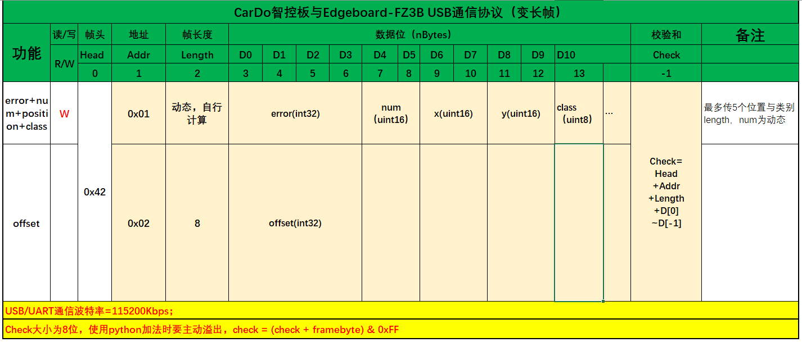

## b站讲解

[这是我初学时写的代码，代码以及视频可能有错，还望见谅，非常感谢能指出错误的大佬](https://www.bilibili.com/video/BV1hF4m157pU/?vd_source=828dec799beba7ebcdcc0daea7104880)

## 所需知识

python，threading，serial

pip install pyserial

## 物理连接

使用usb转ttl
- usb接上位机
- ttl的rx，tx接单片机的tx，rx，gnd接gnd

## 虚拟连接

Virtual Serial Port Driver  
https://www.virtual-serial-port.org/vspd-post-download.html

## 上位机uart代码

初始化port，baudrate，timeout

```python
def uart_initial():
    # 初始化
    # 设置串口参数
    # port = "COM20"# win根据实际情况修改串口号
    # port = "/dev/ttyS1" #linux
    port = "/dev/ttyUSB0" #linux
    baudrate = 115200  # 波特率
    timeout = 1  # 超时时间（秒）

    # 创建串口对象
    ser = serial.Serial(port, baudrate, timeout=timeout)

    return ser
```

消息体



发送消息

```python
def uart_send(ser, address1=b'\x01',error= 1000, offset = 2000, positions=[{'x': 0, 'y': 0, 'class': 0},{'x': 0, 'y': 0, 'class': 0}]):
    offsetFrame = b''#初始化帧
    offsetLength = b"\x00"#初始
    # 构建数据帧
    header = b'\x42'# 帧头
    address2=b'\x02' # 地址 
    offsetLength = 8 # 数据长度
    offsetLength = offsetLength.to_bytes(1, 'big')  # 转换为1字节的大端字节序
    offset = 2000      #offset##########一个格子为4000#############################################################################
    offset = int(offset).to_bytes(4, 'big')#转换为4字节的大端字节序
    offsetFrame = header + address2 + offsetLength + offset
    offsetCheck=0 #计算校验位
    for byte in offsetFrame:
        offsetCheck = (offsetCheck + byte) & 0xFF # 一字节一字节地累加
    offsetFrame += bytes([offsetCheck])
    for byte in offsetFrame:
        ser.write(byte.to_bytes(1, 'big'))  # 将字节转换为字节数组并发送
    #######################################################################################
    frame = b''#初始化帧
    if len(positions) == 0:#初始化
    positions=[{'x': 0, 'y': 0, 'class': [0,0]},
                {'x': 0, 'y': 0, 'class': [0,0]},
                {'x': 0, 'y': 0, 'class': [0,0]},
                {'x': 0, 'y': 0, 'class': [0,0]},
                {'x': 0, 'y': 0, 'class': [0,0]}]
    # 构建数据帧
    # 帧头、帧尾、地址和数据长度
    header = b'\x42'        # 帧头
    address1 = b'\x01'      # 地址   
    length = b"\x00"       # 数据长度
    length=len(positions)*5+8#计算数据长度
    length = length.to_bytes(1, 'big')  # 转换为1字节的大端字节序
    error = int(error).to_bytes(4, 'big')  # 转换为4字节的大端字节序
    frame = header + address1 + length + error
    
    for position in positions:# 添加position和class字段
        x = position['x'].to_bytes(2, 'big')  # 转换为2字节的大端字节序
        y = position['y'].to_bytes(2, 'big')  # 转换为2字节的大端字节序
        class_data = position['class'][0].to_bytes(1, 'big')  # 转换为1字节的大端字节序
        position_class_data = x + y + class_data
        frame += position_class_data
    
    # 计算校验位
    check=0
    for byte in frame:
        check = (check + byte) & 0xFF # 一字节一字节地累加
    frame += bytes([check])
    # print(len(frame))
    # 发送数据帧
    for byte in frame:
        ser.write(byte.to_bytes(1, 'big'))  # 将字节转换为字节数组并发送
        # print(byte)
```

线程接收消息

```python
uart_flage=0#0:训线1：任务
left_right_run=1#1:中线，0：左线，3：右线
def uart_re(ser):
    global uart_flage
    global left_right_run
    while True:
        time.sleep(0.0001)
        if ser.in_waiting > 0:
            temp1 = ser.read()
            print(temp1)
            if(temp1==b'\x66'):
                uart_flage=0
            elif(temp1==b'\x77'):
                uart_flage=1  
            elif(temp1==b'\x88'):
                left_right_run=0#left
            elif(temp1==b'\x99'):
                left_right_run=2#right
            elif(temp1==b'\x55'):
                left_right_run=1#center

def uart_re_start(ser):
    global uart_flage
    global left_right_run
    uart_thread = threading.Thread(target=uart_re, args=(ser,))
    uart_thread.daemon = True
    uart_thread.start()
```

如何调用

```python
ser=uart_initial()
uart_re_start(ser)
uart.uart_send(ser,address1=b'\x01',error=error_result,offset=offset_result,positions=filtered_results)
```

使用时非常乱，建议按照代码规范写，将这些封装在一个类里面

```python
import threading
import serial
import time

class UARTThread(threading.Thread):
    def __init__(self, port="/dev/ttyUSB0", baudrate=115200, timeout=1):
        super().__init__()
        self.port = port
        self.baudrate = baudrate
        self.timeout = timeout
        self.ser = serial.Serial(self.port, self.baudrate, timeout=self.timeout)
        self.uart_flage = 0
        self.left_right_run = 1

    def run(self):
        self.uart_re()

    def uart_re(self):
        while True:
            time.sleep(0.0001)
            if self.ser.in_waiting > 0:
                temp1 = self.ser.read()
                print(temp1)
                if temp1 == b'\x66':
                    self.uart_flage = 0
                elif temp1 == b'\x77':
                    self.uart_flage = 1
                elif temp1 == b'\x88':
                    self.left_right_run = 0  # left
                elif temp1 == b'\x99':
                    self.left_right_run = 2  # right
                elif temp1 == b'\x55':
                    self.left_right_run = 1  # center
        
    def uart_send(self, address1=b'\x01', error=1000, offset=2000, positions=[{'x': 0, 'y': 0, 'class': [0,0]},{'x': 0, 'y': 0, 'class': [0,0]}]):
            offsetFrame = b''#初始化帧
            offsetLength = b"\x00"#初始
            # 构建数据帧
            header = b'\x42'# 帧头
            address2=b'\x02' # 地址 
            offsetLength = 8 # 数据长度
            offsetLength = offsetLength.to_bytes(1, 'big')  # 转换为1字节的大端字节序
            offset = 2000      #offset##########一个格子为4000#############################################################################
            offset = int(offset).to_bytes(4, 'big')#转换为4字节的大端字节序
            offsetFrame = header + address2 + offsetLength + offset
            offsetCheck=0 #计算校验位
            for byte in offsetFrame:
                offsetCheck = (offsetCheck + byte) & 0xFF # 一字节一字节地累加
            offsetFrame += bytes([offsetCheck])
            for byte in offsetFrame:
                self.ser.write(byte.to_bytes(1, 'big'))  # 将字节转换为字节数组并发送
            #######################################################################################
            frame = b''#初始化帧
            if len(positions) == 0:#初始化
                positions=[{'x': 0, 'y': 0, 'class': [0,0]},
                            {'x': 0, 'y': 0, 'class': [0,0]},
                            {'x': 0, 'y': 0, 'class': [0,0]},
                            {'x': 0, 'y': 0, 'class': [0,0]},
                            {'x': 0, 'y': 0, 'class': [0,0]}]
            # 构建数据帧
            # 帧头、帧尾、地址和数据长度
            header = b'\x42'        # 帧头
            address1 = b'\x01'      # 地址   
            length = b"\x00"       # 数据长度
            length=len(positions)*5+8#计算数据长度
            length = length.to_bytes(1, 'big')  # 转换为1字节的大端字节序
            error = int(error).to_bytes(4, 'big')  # 转换为4字节的大端字节序
            frame = header + address1 + length + error
            
            for position in positions:# 添加position和class字段
                x = position['x'].to_bytes(2, 'big')  # 转换为2字节的大端字节序
                y = position['y'].to_bytes(2, 'big')  # 转换为2字节的大端字节序
                class_data = position['class'][0].to_bytes(1, 'big')  # 转换为1字节的大端字节序
                position_class_data = x + y + class_data
                frame += position_class_data
            
            # 计算校验位
            check=0
            for byte in frame:
                check = (check + byte) & 0xFF # 一字节一字节地累加
            frame += bytes([check])
            # print(len(frame))
            # 发送数据帧
            for byte in frame:
                self.ser.write(byte.to_bytes(1, 'big'))  # 将字节转换为字节数组并发送
                # print(byte)`

if __name__ == '__main__':
    # Example usage:
    uart_thread = UARTThread(port="com1")
    uart_thread.start()
    
    while True:
        uart_thread.uart_send()
        time.sleep(1)
    # Then you can access uart_send, uart_flage, and left_right_run attributes/methods from uart_thread instance.

```
